# Enhancement of Night Vision IR Images using Verilog
Applying various image enhancement algorithms on Night Vision IR images using Xilinx Vivado.

Details about the file names in `filenames.txt`.

## Brief
* **Aim:** To apply image enhancement algorithms on Night Vision infrared images using Xilinx Vivado.

* **Algorithms used:**
  1. [Histogram Equalisation](#1-histogram-equalisation)
  2. [Histogram Matching](#2-histogram-matching)
  3. [Double Plateau Histogram Equalisation](#3-double-plateau-histogram-equalisation)
  4. [Top Hat Transform](#4-top-hat-transform)

* [**Performance Comparison**](#performance-comparison-of-the-algorithms)
* [**Verilog Implementation**](#verilog-implementation)
* [**Future Scope**](#future-scope)
* [**Acknowledgement**](#acknowledgement)

**Dataset:** [ir:iricra2014 – ASL Datasets](https://projects.asl.ethz.ch/datasets/doku.php?id=ir:iricra2014)

## Algorithms

### 1. Histogram Equalisation
* A contrast stretching algorithm with a mathematical function that uniformly stretches the image histogram.
* Calculate the  probability and cumulative distribution function(CDF) of gray scale values, normalize the values by multiplying  CDF values with the greatest gray scale level.
* Stretches the intensity values present in the image to the entire range of intensity values, thus increasing the contrast of the image.

**Sample Results:**

<table border="0">
 <tr>
    <td></td>
    <td><b style="font-size:15px">
Image</b></td>
    <td><b style="font-size:15px">
Histogram</b></td>
 </tr>
 <tr>
    <td>
Original
</td>
    <td>
      

        
      

    </td>
    <td>
      

        
      

    </td>
 </tr>
 <tr>
    <td>
Enhanced</td>
    <td>
      

        
      

    </td>
    <td>
      

        
      

    </td>
 </tr>
</table>

### 2. Histogram Matching
* Extension of histogram equalization.
* This algorithm transforms a target image so that it’s histogram matches with the histogram of a given reference image.
* Firstly, histogram equalization is performed on both, the target and the reference image, which is then followed by the matching part.
* The target image histogram is manipulated such that it matches the histogram of the reference image.

**Sample Results:**

<table border="0">
 <tr>
    <td></td>
    <td><b style="font-size:15px">
Image</b></td>
    <td><b style="font-size:15px">
Histogram</b></td>
 </tr>
 <tr>
    <td>
Reference
</td>
    <td>
      

        
      

    </td>
    <td>
      

        
      

    </td>
 </tr>
 <tr>
    <td>
Target</td>
    <td>
      

        
      

    </td>
    <td>
      

        
      

    </td>
 </tr>
 <tr>
    <td>
Target after Histogram Matching</td>
    <td>
      

        
      

    </td>
    <td>
      

        
      

    </td>
 </tr>
</table>

### 3. Double Plateau Histogram Equalisation
* In the image histogram, there are certain grayscale values (bins) which have exceptionally high frequencies while some have very low.
* Thus, we select two threshold values of frequencies, and clip the bins according to these thresholds.
* The excess pixels in a high frequency bin are redistributed into the bins having low frequencies.

**Sample Results:**

<table border="0">
 <tr>
    <td></td>
    <td><b style="font-size:15px">
Image</b></td>
    <td><b style="font-size:15px">
Histogram</b></td>
 </tr>
 <tr>
    <td>
Original
</td>
    <td>
      

        
      

    </td>
    <td>
      

        
      

    </td>
 </tr>
 <tr>
    <td>
Enhanced</td>
    <td>
      

        
      

    </td>
    <td>
      

        
      

    </td>
 </tr>
</table>

**Clipped Frequencies Graph:**
 

   
 

### 4. Top Hat Transform
* In digital image processing, the algorithm extracts minute elements and details from the images.
* Considering structural elements, the filter enhances bright  objects of interests in a dark background.
* Hence, it focuses on enhancing the light pixels in dark background.

<table border="0">
 <tr>
    <td><b style="font-size:15px">
Original Image</b></td>
    <td><b style="font-size:15px">
Enhanced Image</b></td>
 </tr>
 <tr>
    <td>
      

        
      

    </td>
    <td>
      

        
      

    </td>
 </tr>
</table>

## Performance Comparison of the Algorithms
* **Peak Signal to Noise Ratio (PSNR)**: It uses the mean squared error of all the pixels between the two images to compute an expression.
* The higher the PSNR value, the better the image enhancement.
* We compare the PSNR value of all the 4 new images with an enhanced image obtained using an advanced, inbuilt image processing function on MATLAB.
* Based on the PSNR values, Double Plateaus Histogram Equalization and Histogram Equalization were the best performing algorithms.

Results:
* Histogram Equalisation PSNR = 14.132
* Histogram Matching PSNR = 13.722
* Double Plateau Histogram Equalisation PSNR = 21.523
* Top Hat Transform PSNR = 9.854

## Verilog Implementation

### 1. Reading images in Vivado
* Images need to be converted to binary text files to be read onto Vivado.
* The entire image is flattened to a 1 D array, each element contains the pixel’s intensity value in binary 8 bit format using Python.
* The file can be read using the readmemb function on Vivado.

### 2. Performing the algorithms in Vivado
* The image is read on the testbench and passed to the design module.
* The design consists of a single module:
 * It inputs the image as a 1 D array and converts it to a 2 D array of dimensions same as that of the original image.
 * The algorithm is now performed on this 2 D array that represents the image.
 * This image is again flattened to a 1 D image and sent as an output to the testbench.
The output is received at the testbench and written into a binary file.
This binary text file is converted to obtain the new image using python.

### 3. Comparing the algorithms in Vivado

Comparison:
<table>
<thead>
  <tr>
    <th></th>
    <th>Original</th>
    <th>DPHE</th>
    <th>HE</th>
    <th>Advanced Enhanced Image</th>
  </tr>
</thead>
<tbody>
  <tr>
    <td>
Image 1</td>
    <td>

        
      

    </td>
    <td>

        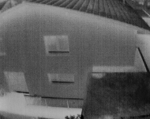
      

   </td>    
   <td>

        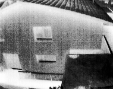
      

   </td>  
   <td>

        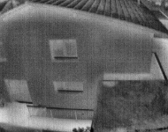
      

   </td>
 </tr>
  <tr>
    <td>
Image 2</td>
    <td>

        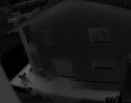
      

    </td>
    <td>

        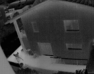
      

   </td>    
   <td>

        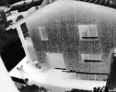
      

   </td>  
   <td>

        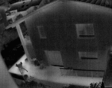
      

   </td>
 </tr>
  <tr>
    <td>
Image 3</td>
    <td>

        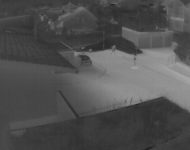
      

    </td>
    <td>

        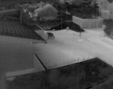
      

   </td>    
   <td>

        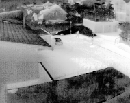
      

   </td>  
   <td>

        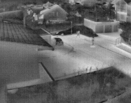
      

   </td>
 </tr>
  <tr>
    <td>
Image 4</td>
    <td>

        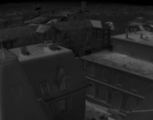
      

    </td>
    <td>

        
      

   </td>    
   <td>

        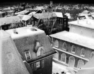
      

   </td>  
   <td>

        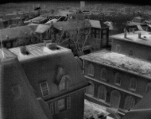
      

   </td>
 </tr>
</tbody>
</table>

PSNR values of images obtained from both the algorithms for different images:

<table border="0">
 <tr>
  <td>
Image no.</td>
  <td>
PSNR after  Histogram Equalisation</td>
  <td>
PSNR after  Double Plateaus Histogram Equalisation</td>
 </tr>
 <tr>
  <td>
Image 1</td>
  <td>
12.703</td>
  <td>
23.120</td>
 </tr>
 <tr>
  <td>
Image 2</td>
  <td>
9.144</td>
  <td>
24.936</td>
 </tr>
 <tr>
  <td>
Image 3</td>
  <td>
14.333</td>
  <td>
18.820</td>
 </tr>
 <tr>
  <td>
Image 4</td>
  <td>
9.864</td>
  <td>
22.864</td>
 </tr> 
</table>

* After performing the algorithms on different images, we can see that the PSNR values are higher for Double Plateaus Histogram Equalization in all cases.
* Thus, Double Plateaus Histogram Equalization is the best amongst the ones that were used.

## Future Scope
* If we are able to perform these algorithms on each frame in a video fast enough, we can get real time video enhancement.
* Applying these algorithms on Night vision goggles can improve the enhancement of images.

## Acknowledgement

The code and documentation has been done by all 4 team members Aadesh Desai, Eshan Gujarathi, Saagar Parikh and Sanjay Venkitesh. We would like to thank Prof. Joycee Mekie (Assistant Professor, IIT Gandhinagar) and the Teaching Assistants for providing us with the necessary guidance during the course of the project.
